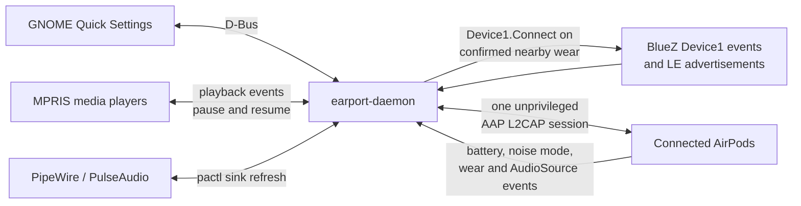

# EarPort Handoff

Experimental AirPods integration for GNOME, with AirPods Max 2 support and Apple/Linux audio-source handoff.

[](https://github.com/mimimiku778/earport-handoff/actions/workflows/ci.yml)


This is a GPL-licensed fork of [Anoryth/EarPort](https://github.com/Anoryth/earport). It keeps EarPort's GNOME Quick Settings UI, battery reporting, listening-mode controls, and wear-based media control, then adds:

- AirPods Max 2 (`A3454`, AAP model ID `0x2D20`) recognition and capabilities;
- parsing of AAP `AudioSource` notifications;
- Linux audio ownership requests through AAP `OwnsConnection`;
- MPRIS pause/resume coordination when audio ownership changes;
- wear-triggered connection from a disconnected state for AirPods 4, AirPods 4 with ANC, and AirPods Max 2 using BLE advertisements and BlueZ;
- safe selection between multiple connected AirPods while maintaining only one AAP control session.

The handoff path is built into the EarPort daemon. Battery, ANC, wear detection, and handoff therefore share one Apple Accessory Protocol (AAP) L2CAP connection instead of competing for the same private Bluetooth service.

> [!WARNING]
> This project uses reverse-engineered private Apple protocols. It is not equivalent to Apple Account automatic switching, and firmware or BlueZ changes may break it. See [What has actually been verified](#what-has-actually-been-verified) before relying on it.


## Where the implementation comes from

This fork combines code and research from separate projects, with their roles kept explicit:

| Source | Used for | Licensing treatment |
|---|---|---|
| [Anoryth/EarPort](https://github.com/Anoryth/earport) | Application base: C daemon, GNOME extension, D-Bus API, battery/noise/wear handling, and MPRIS integration | This repository is a modified fork and retains its GPL-3.0-or-later history and notices. |
| [LibrePods](https://github.com/librepods-org/librepods) | GPL-licensed AAP documentation and implementation knowledge, including `AudioSource` and `OwnsConnection` semantics | The new protocol handling is an integrated GPL implementation informed by LibrePods. |
| [CAPod](https://github.com/d4rken-org/capod) | Cross-checking AirPods 4/Max 2 BLE model identifiers, public advertisement layout, and Max 2 wear bits | CAPod is GPL-licensed. The disconnected-wear detector adapts this published protocol knowledge to BlueZ; connected wear handling still uses EarPort's AAP events. |
| [xatuke/handoff](https://github.com/xatuke/handoff) | Behavioral inspiration for Apple/Linux ownership switching | No source code was copied. That repository had no license file when this fork was prepared, so this project does not assign it a license or incorporate its code. |

See [CREDITS](CREDITS) for full acknowledgements.

## How it works



The daemon follows this sequence:

1. While enabled, EarPort owns a BlueZ LE discovery session and watches Apple company (`0x004c`) Proximity Pairing advertisements.
2. After seeing an unworn baseline on the same rotating advertisement object, two nearby worn/in-ear advertisements within two seconds trigger an asynchronous `Device1.Connect()` call. AirPods 4 requires both buds to report in-ear; Max 2 accepts either cup sensor. The BLE model must map to exactly one disconnected paired AirPods device, and a 30-second cooldown suppresses reconnect loops.
3. BlueZ reports the paired AirPods device as connected.
4. EarPort opens one unprivileged L2CAP `SOCK_SEQPACKET` connection to the AirPods AAP service on PSM `0x1001`, performs the handshake, and subscribes to notifications.
5. The daemon gets the Bluetooth adapter address selected for that exact socket and uses it to distinguish Linux from another `AudioSource` device.
6. When an MPRIS player enters `Playing`, EarPort sends an AAP `OwnsConnection` claim. It then briefly cycles the matching BlueZ audio sink through `pactl` so PipeWire/PulseAudio reopens the stream after ownership changes.
7. If AAP reports that another device took the media source, EarPort pauses currently playing MPRIS players and remembers only the players it paused.
8. When that source releases the AirPods, EarPort resumes those players. Resume is deferred if the current wear state says the AirPods are off-head/out-of-ear.
9. A call source on another device is treated specially: Linux does not claim over it and waits for the call to release the AirPods.

Wear detection controls media, not the Bluetooth link. Removing the headphones
normally leaves them connected to Linux so EarPort can keep receiving AAP
events and coordinate a later handoff. With the default wear policy, an
MPRIS player that is started again while a known off-head/out-of-ear state is
active is paused again and does not trigger a Linux ownership claim.

If two AirPods are connected, the most recently connected pair becomes the active EarPort device. A delayed disconnect event from the previous pair is ignored. This is sequential multi-device support, not two simultaneous AAP sessions.

### Why standalone handoff must not run beside this fork

EarPort features and handoff use the same proprietary AirPods service UUID and L2CAP PSM. Running a separate `airpods-handoff` or LibrePods daemon at the same time can create competing handshakes, lost notifications, reconnect loops, or ownership fights.

The installer refuses to continue when known conflicting user services are enabled. If needed, stop them first:

```bash
systemctl --user disable --now airpods-handoff.service
systemctl --user disable --now librepods-daemon.service
```

Do not launch `airpods-handoff` manually alongside `earport-daemon`, either.

## Model support

“Implemented” below describes code paths and automated tests. It does not imply that every model has been physically tested in this fork.

| Model | Implementation status | Physical validation in this fork |
|---|---|---|
| AirPods 1 / 2 / 3, AirPods Pro / Pro 2 / Pro 3 | Inherited from upstream EarPort | Not repeated for this fork |
| AirPods Max (Lightning and USB-C) | Inherited; retains the Max 1 single-AAP-slot wear workaround | Not repeated for this fork |
| AirPods 4 | Model numbers `A3050`, `A3053`, and `A3054` recognized and unit-tested | Plain non-ANC model not tested |
| **AirPods 4 with ANC** | Model numbers `A3055`, `A3056`, and `A3057`; ANC and Adaptive capabilities enabled | **Core connected-AAP path verified on an `A3056` pair** |
| **AirPods Max 2** | Model `A3454`; headphones, ANC, and Adaptive capabilities enabled; raw dual-slot AAP wear state retained | **Core connected-AAP path verified on real hardware** |

Max 2 intentionally does not reuse the first-generation Max workaround that mirrors one AAP wear slot into both sides. Real Max 2 hardware produced distinct primary and secondary AAP values, so this fork preserves both.

## What has actually been verified

### Automated verification

The current code has passed:

- a clean Meson debug build with warnings treated as errors;
- five Meson test groups: model/configuration, AAP packet handling, two-device connection policy, connected wear policy, and disconnected BLE wear auto-connect;
- AddressSanitizer and UndefinedBehaviorSanitizer builds/tests;
- the GitHub Actions build, unit-test, and installer syntax checks.

These tests verify packet parsing and command bytes, Max 2 and AirPods 4 model mapping, capability selection, handoff defaults, device-switch decisions, connected wear-policy transitions, and BLE auto-connect confirmation/rearm behavior. They cannot prove behavior against every AirPods firmware or Apple device.

### Physical verification

The reference system was:

- Ubuntu 26.04.1 LTS;
- GNOME Shell 50.1 on Wayland;
- BlueZ 5.85;
- PipeWire 1.6.2 with its PulseAudio compatibility service.

| Device | Observed on real hardware |
|---|---|
| **AirPods Max 2** | Re-pairing after the BlueZ `DeviceID` change; unprivileged L2CAP connection; AAP metadata `A3454` and model classification; battery notification; ANC state; distinct two-slot AAP wear `IN`/`OUT` events; Chromium pausing through MPRIS after an off-head transition; local Linux `AudioSource` ownership claim; and a real disconnected, off-head-to-worn BLE transition causing an automatic BlueZ connection followed by a successful AAP session. |
| **AirPods 4 with ANC** | AAP metadata `A3056` and model classification; BlueZ product ID `0x201B`; battery notifications for left/right buds; ANC state; `IN`/`IN` wear event; local `AudioSource` transition from `NONE` to `MEDIA (Linux)`. |

The Max 2 wear sensors can be fooled by holding or gripping the ear cups: AAP may report `IN` even when the headphones are not on a head. EarPort can only act on the state reported by the hardware, so off-head behavior is not guaranteed while the cups are being handled. The observed physical result was a correct MPRIS pause on an ordinary removal transition.

### Not yet conclusively verified

- End-to-end automatic routing from Linux to an iPhone, iPad, or Mac and back while the AirPods are worn.
- Remote `CALL` ownership against a real Apple-device call.
- Disconnected-wear auto-connect on AirPods 4 or AirPods 4 with ANC hardware.
- Plain AirPods 4 hardware.
- All inherited AirPods generations and all firmware versions.

During iPhone attempts, the BlueZ device disconnected/reconnected, so those attempts are not counted as proof of AAP handoff. An iPhone using its internal speaker while AirPods Max 2 is unworn is normal wear-routing behavior, not a successful handoff result.

## Ubuntu installation

### Requirements

- GNOME Shell 46–50;
- BlueZ;
- PipeWire with `pipewire-pulse`, or PulseAudio;
- AirPods paired after the `DeviceID` change described below.

Install the build and runtime packages:

```bash
sudo apt update
sudo apt install -y \
  git meson ninja-build pkg-config \
  libglib2.0-dev libbluetooth-dev \
  pulseaudio-utils
```

`pulseaudio-utils` supplies `pactl`; it also controls PipeWire sinks when `pipewire-pulse` is active.

### 1. Configure BlueZ before pairing

Back up the current configuration without overwriting an earlier backup:

```bash
sudo cp --no-clobber \
  /etc/bluetooth/main.conf \
  /etc/bluetooth/main.conf.pre-earport
sudoedit /etc/bluetooth/main.conf
```

Add the following line inside the existing `[General]` section. Do not create a second `[General]` section.

```ini
DeviceID = bluetooth:004C:0000:0000
```

Restart Bluetooth:

```bash
sudo systemctl restart bluetooth
```

This is a system-wide BlueZ setting. AirPods cache the host identity at pairing time, so remove every affected AirPods pairing from Ubuntu and pair each device again after making the change. A stale pairing commonly results in a missing AAP connection or `br-connection-key-missing` errors.

### 2. Build and install

```bash
git clone https://github.com/mimimiku778/earport-handoff.git
cd earport-handoff
./install.sh
```

The installer:

- builds the C daemon;
- installs it under `~/.local`;
- installs and enables `earport-daemon.service` as a sandboxed systemd user service;
- installs the GNOME extension at `~/.local/share/gnome-shell/extensions/earport@anoryth.github.io`;
- attempts to enable the extension.

The daemon runs as the logged-in user. It does not require root, `CAP_NET_RAW`, or another Linux capability.

### 3. Load the GNOME panel

On Wayland, log out completely and log back in once after installation. Locking and unlocking the session is not enough. If GNOME Shell had not discovered the extension during installation, enable it after logging back in:

```bash
gnome-extensions enable earport@anoryth.github.io
```

Connect one of the re-paired AirPods from GNOME Settings. The **EarPort** tile appears in the system **Quick Settings** panel at the top right. Expand it to view battery data and the controls supported by the detected model.

## Configuration

Handoff is enabled by default in `~/.config/earport/daemon.conf`:

```ini
[Settings]
ear_pause_mode=1
handoff_enabled=true
auto_connect_on_wear=true
```

The wear-pause modes are:

| Value | Behavior |
|---:|---|
| `0` | Disabled |
| `1` | Pause when either side is removed |
| `2` | Pause only when both sides are removed |

To keep upstream EarPort features but disable audio-source ownership, set `handoff_enabled=false`, save the file, and restart the daemon:

```bash
systemctl --user restart earport-daemon.service
```

Set `auto_connect_on_wear=false` to stop continuous LE discovery and disable
connection attempts initiated by disconnected wear advertisements.

## Checking the installation

Confirm that the daemon and extension are installed:

```bash
systemctl --user status earport-daemon.service
gnome-extensions info earport@anoryth.github.io
```

Follow the daemon while connecting and wearing/removing the AirPods:

```bash
journalctl --user -u earport-daemon.service -f
```

For a working AAP session, the log should show a connection followed by metadata/battery/noise or wear notifications. Starting an MPRIS-aware player should produce a Linux ownership request and, after AirPods confirmation, an `AudioSource` entry identified as Linux.

You can inspect all state exposed to the GNOME extension with:

```bash
gdbus call --session \
  --dest io.github.anoryth.EarPort \
  --object-path /io/github/anoryth/EarPort \
  --method org.freedesktop.DBus.Properties.GetAll \
  io.github.anoryth.EarPort1
```

Logs and D-Bus output may contain Bluetooth addresses. Redact them before posting public issue reports.

## Current limitations

- Playback-triggered handoff requires an existing Linux Bluetooth connection; starting playback alone does not connect a disconnected pair. The separate wear-triggered path can connect supported models after an unworn-to-worn transition.
- Wear-triggered connection uses a conservative model-and-proximity heuristic because AirPods advertise with a rotating private BLE address. It supports AirPods 4, AirPods 4 with ANC, and AirPods Max 2; requires a same-object unworn baseline, RSSI of at least `-70 dBm`, two worn observations, and exactly one paired device with the matching model. AirPods 4 requires both buds to be in-ear. It refuses ambiguous same-model pairings, but a nearby third-party pair of the same model could still trigger a connection attempt to your paired device.
- Deep AirPods power-saving states may stop or delay the changing BLE wear advertisement. In that state, merely putting Max 2 on may wake neither Linux nor an iPhone; pressing a hardware button can be required before any host can observe the transition. The daemon cannot connect until the hardware advertises again.
- Continuous LE discovery uses additional Bluetooth radio time and may modestly affect power consumption.
- Handoff playback detection is MPRIS-based. Chromium, Spotify, and common desktop players normally expose MPRIS; games and other direct audio clients may not trigger a claim.
- Wear-based playback blocking is also MPRIS-based. It cannot forcibly stop a non-MPRIS application from sending audio to an already connected sink.
- Wear state is unknown until the first AAP wear notification after a connection. The daemon deliberately allows playback while the state is unknown, avoiding a permanent lockout on models or firmware that do not send that notification.
- If another device causes BlueZ to disconnect the Linux Bluetooth link entirely, EarPort loses its AAP channel and cannot observe further source events until Linux reconnects. A player already paused for handoff may then require a manual resume.
- Two paired AirPods can be selected sequentially, but only one device has an AAP control session at a time.
- Wear sensors report proximity, not an authoritative “on a person's head” state. This is particularly visible when AirPods Max 2 is held by the cups.
- Apple Account awareness, iCloud device coordination, and Apple's complete automatic-switching policy are not implemented.
- AAP is private and reverse-engineered; behavior can vary with model and firmware.

## Troubleshooting

### No Quick Settings tile

On Wayland, log out and back in, then run:

```bash
gnome-extensions enable earport@anoryth.github.io
gnome-extensions info earport@anoryth.github.io
```

### Daemon not running

```bash
systemctl --user restart earport-daemon.service
systemctl --user status earport-daemon.service
journalctl --user -u earport-daemon.service -n 100 --no-pager
```

### Connected for audio, but no battery/ANC/wear data

Check that `DeviceID = bluetooth:004C:0000:0000` is inside `[General]`, restart Bluetooth, remove the old pairing, and pair again. The DeviceID must be present when the bond is created.

Also ensure no other AAP daemon is running:

```bash
systemctl --user --type=service --state=running | \
  grep -E 'airpods-handoff|librepods|earport'
```

Only `earport-daemon.service` should own the AAP control connection.

### Linux playback does not claim the AirPods

Confirm that the application exposes an MPRIS player and that an AirPods sink exists:

```bash
busctl --user list | grep org.mpris.MediaPlayer2
pactl list sinks short | grep -i bluez
```

Then watch the EarPort journal while changing the player from paused to playing.

## Development

Build with strict warnings and run all tests:

```bash
meson setup daemon/build daemon \
  --buildtype=debug \
  -Dwerror=true \
  -Dwarning_level=3
meson compile -C daemon/build
meson test -C daemon/build --print-errorlogs
```

The daemon exposes `io.github.anoryth.EarPort` at `/io/github/anoryth/EarPort` on the session bus. The upstream D-Bus name and extension UUID are retained for compatibility.

## Uninstall

```bash
./install.sh --uninstall
```

This stops and disables the user service and removes the installed daemon, D-Bus launcher, systemd unit, and GNOME extension. Log out and back in on Wayland to unload the extension.

The uninstaller intentionally leaves these user/system choices untouched:

- `~/.config/earport`;
- `DeviceID` in `/etc/bluetooth/main.conf`;
- existing Bluetooth pairings.

If EarPort is the only reason for the BlueZ override, remove the `DeviceID` line with `sudoedit /etc/bluetooth/main.conf`, restart Bluetooth, and re-pair devices that should use the restored host identity. Review `/etc/bluetooth/main.conf.pre-earport` rather than blindly overwriting any newer Bluetooth configuration.

## License

This repository is licensed under GPL-3.0-or-later; see [LICENSE](LICENSE). The upstream history and copyright notices are retained.

AirPods and Apple are trademarks of Apple Inc. This independent project is not affiliated with or endorsed by Apple.
