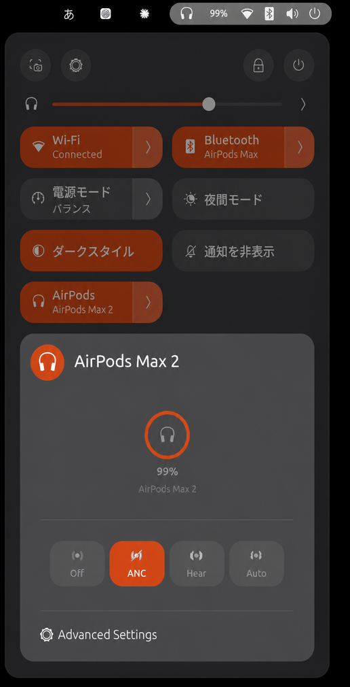
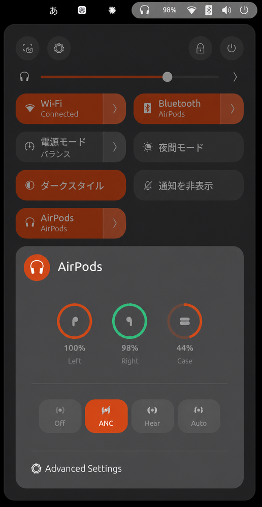

# AirPods Seamless Switching for Ubuntu

Automatic wear connection, removal disconnection, and Apple/Linux audio handoff for AirPods on GNOME.

[](https://github.com/mimimiku778/earport-handoff/actions/workflows/ci.yml)


<table>
  <tr>
    <td align="center"></td>
    <td align="center"></td>
  </tr>
  <tr>
    <td align="center"><strong>AirPods Max 2</strong></td>
    <td align="center"><strong>AirPods 4 with ANC</strong></td>
  </tr>
</table>

## Install, completely uninstall, or update

### Install

Requirements: **Ubuntu 26.04 or newer** with GNOME, BlueZ, and PipeWire.

```bash
sudo apt update
sudo apt install -y \
  git build-essential meson ninja-build pkg-config \
  libglib2.0-dev libbluetooth-dev \
  pulseaudio-utils
```

Before pairing, make Ubuntu identify itself to AirPods as an Apple Bluetooth host:

```bash
sudo cp --no-clobber \
  /etc/bluetooth/main.conf \
  /etc/bluetooth/main.conf.pre-earport
sudoedit /etc/bluetooth/main.conf
```

Add this inside the existing `[General]` section:

```ini
DeviceID = bluetooth:004C:0000:0000
```

Then restart Bluetooth, remove the old Ubuntu AirPods pairings, and pair again:

```bash
sudo systemctl restart bluetooth
git clone https://github.com/mimimiku778/earport-handoff.git
cd earport-handoff
./install.sh
```

Log out and back in once on Wayland. The **AirPods** tile appears in GNOME's top-right Quick Settings panel. If needed:

```bash
gnome-extensions enable earport@anoryth.github.io
```

### Completely uninstall

```bash
cd earport-handoff
./install.sh --uninstall
```

This removes the daemon, service, GNOME extension, and all EarPort user settings. If you added the `DeviceID` line only for this project, remove it from `/etc/bluetooth/main.conf`, then run:

```bash
sudo systemctl restart bluetooth
```

Alternatively, restore the backup created above if it is still the BlueZ configuration you want to keep:

```bash
sudo cp -- \
  /etc/bluetooth/main.conf.pre-earport \
  /etc/bluetooth/main.conf
sudo systemctl restart bluetooth
```

After confirming Bluetooth works, the backup is no longer needed and may be removed with `sudo rm -- /etc/bluetooth/main.conf.pre-earport`. The installer never deletes this system backup automatically.

Bluetooth pairings are intentionally left intact.
AirPods cache host identity, so re-pair them if you remove or restore the `DeviceID` override.

### Update to the latest version

```bash
cd earport-handoff
./install.sh --update
```

The updater fast-forwards this fork's stable branch, rebuilds both components, and restarts the daemon. Upstream EarPort changes are reviewed separately before they reach users.

> [!WARNING]
> This project uses private, reverse-engineered Apple protocols. It is not iCloud/Apple Account automatic switching, and firmware changes may affect it.

## What this fork adds to EarPort

This is a fork of [Anoryth/EarPort](https://github.com/Anoryth/earport). It keeps the upstream battery, noise-control, wear-detection, and GNOME UI features, then adds:

| Addition | Behavior |
|---|---|
| **AirPods Max 2** | Recognizes `A3454`, exposes ANC/Adaptive controls, and uses both wear-sensor slots. |
| **BLE wear auto-connect** | Wearing AirPods Max 2 or either AirPods 4 bud connects its paired device automatically. |
| **Removal disconnect** | On Max 2 and AirPods 4, removing both sides pauses owned media; after one second, Ubuntu disconnects Bluetooth. Re-wearing starts a new connection cycle. |
| **One-bud AirPods 4 use** | One inserted bud counts as worn, so the other may remain in its case. |
| **Apple/Linux handoff** | Ubuntu claims AirPods when local playback starts and yields when another Apple device requests them. |
| **High-quality routing** | Selects A2DP, moves active streams, and ignores early HFP/HSP call-quality sinks. |

All features share one lightweight EarPort daemon. Do not run LibrePods or a standalone `airpods-handoff` daemon at the same time.

This fork keeps EarPort's extension UUID and D-Bus API for compatibility, so installing it replaces an upstream EarPort installation; the two cannot run side by side.

The implementation combines these pieces:

| Source | Role in this fork |
|---|---|
| [EarPort](https://github.com/Anoryth/earport) | C daemon, GNOME UI, battery, noise control, and connected wear detection. |
| [LibrePods](https://github.com/librepods-org/librepods) and public AAP notes | Apple Accessory Protocol packet behavior used by the integrated handoff path. |
| [CAPod](https://github.com/d4rken-org/capod) and [omarchy-pods](https://github.com/thisisgm/omarchy-pods) | AirPods 4/Max 2 identifiers and BLE wear data cross-checks. |
| [xatuke/handoff](https://github.com/xatuke/handoff) | Switching-behavior reference only; no source code was copied. |

While disconnected, the daemon watches Apple BLE wear advertisements and asks BlueZ to connect the one matching paired device. Once connected, one AAP control session drives battery, ANC, wear, and ownership events; MPRIS and the async A2DP router coordinate Linux playback.

## Supported devices

| Device | Status |
|---|---|
| **AirPods Max 2 (`A3454`)** | Implemented and hardware-tested |
| **AirPods 4 with ANC (`A3055` / `A3056` / `A3057`)** | Implemented; `A3055` and `A3056` hardware-tested |
| AirPods 4 (`A3050` / `A3053` / `A3054`) | Implemented; plain model not tested here |
| Earlier AirPods, AirPods Pro, and AirPods Max | Inherited from EarPort |

Disconnected BLE wear connection is enabled for AirPods 4 and AirPods Max 2. Only one AirPods control session is active at a time.

## Switching behavior

- A confirmed unworn-to-worn BLE transition connects the matching paired AirPods.
- Ubuntu selects the matching A2DP output and moves active streams.
- Starting an MPRIS player asks the AirPods to switch to Ubuntu.
- When an Apple device takes ownership, Ubuntu yields and pauses its player.
- A new explicit Ubuntu playback action takes ownership back.
- On Max 2 and AirPods 4, taking both sides off pauses media and disconnects Bluetooth after one second.

Transient AirPods 4 `AudioSource=NONE` events never trigger an automatic reclaim, preventing ownership fights with an iPhone or Mac.

## Settings

`${XDG_CONFIG_HOME:-$HOME/.config}/earport/daemon.conf`:

```ini
[Settings]
ear_pause_mode=2
handoff_enabled=true
auto_connect_on_wear=true
disconnect_on_removal=true
```

`ear_pause_mode=2` pauses only when both sides are out and is recommended for one-bud use. Use `1` to pause when either side is removed, or `0` to disable wear pause.

Restart after editing:

```bash
systemctl --user restart earport-daemon.service
```

### Keep A2DP audio quality

To stop WirePlumber switching AirPods to low-quality HFP/HSP when an application opens a microphone, use the command matching your version:

Ubuntu 26.04 and newer (WirePlumber 0.5+):

```bash
wpctl settings --save bluetooth.autoswitch-to-headset-profile false
```

This keeps AirPods on A2DP and uses another microphone. Restore WirePlumber 0.5 with:

```bash
wpctl settings --delete bluetooth.autoswitch-to-headset-profile
wpctl settings --reset bluetooth.autoswitch-to-headset-profile
```

## Troubleshooting

```bash
systemctl --user status earport-daemon.service
gnome-extensions info earport@anoryth.github.io
journalctl --user -u earport-daemon.service -f
```

- **No Quick Settings tile:** log out and back in on Wayland, then enable the extension.
- **No battery, ANC, or wear data:** confirm the BlueZ `DeviceID`, remove the old pairing, and pair again.
- **Poor call-quality audio:** apply the WirePlumber A2DP setting above.
- **Unstable ownership:** stop other AirPods daemons and check whether a nearby iPhone or Mac is taking the AirPods.
- **No playback handoff:** the application must expose MPRIS.

## Limits

- Deep AirPods sleep can stop BLE advertisements; pressing a hardware button may be required before any host sees them.
- AirPods Max sensors detect proximity, not proof that the headphones are on a head. Holding the cups can look worn.
- Starting playback does not connect a completely disconnected pair; the BLE wear transition performs that connection.
- Apple Account awareness and Apple's complete switching policy are not implemented.

## Development

```bash
meson setup daemon/build daemon \
  --buildtype=debug \
  -Dwerror=true \
  -Dwarning_level=3
meson compile -C daemon/build
meson test -C daemon/build --print-errorlogs
bash -n install.sh
```

Unit tests cover model mapping, AAP packets, connection/wear policy, BLE auto-connect, MPRIS aggregation, audio routing, and handoff yielding. AirPods Max 2 and AirPods 4 with ANC were also tested on real hardware running Ubuntu 26.04.1 and GNOME 50.1.

### Following upstream EarPort

This repository preserves EarPort's Git history but is maintained as an independent GitHub repository. `UPSTREAM_BASE` records the last reviewed EarPort revision, and a scheduled workflow opens an issue when newer upstream commits appear.

```bash
./scripts/check-upstream.sh
git switch -c sync-upstream
git merge --no-ff upstream/main
```

Run the full test suite before updating `UPSTREAM_BASE` and merging the sync branch. Upstream changes are never pulled by an end user's `./install.sh --update`.

## Credits and license

The app and GNOME UI come from EarPort. AAP behavior was informed by LibrePods; model and BLE wear handling were cross-checked against omarchy-pods, CAPod, and public protocol notes. See [CREDITS](CREDITS) for exact attribution.

GPL-3.0-or-later; see [LICENSE](LICENSE). AirPods and Apple are trademarks of Apple Inc. This project is not affiliated with Apple.
